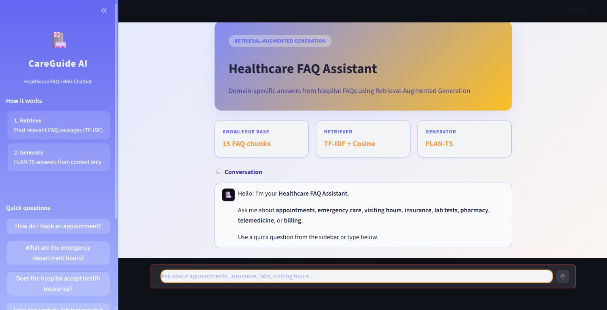
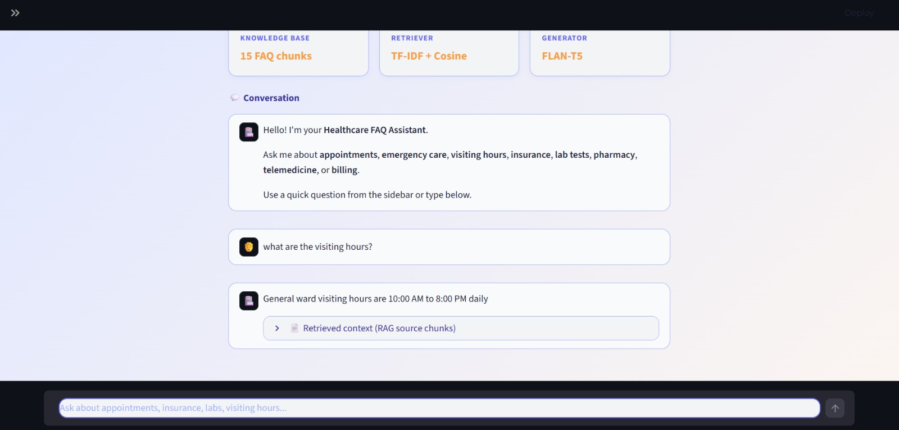
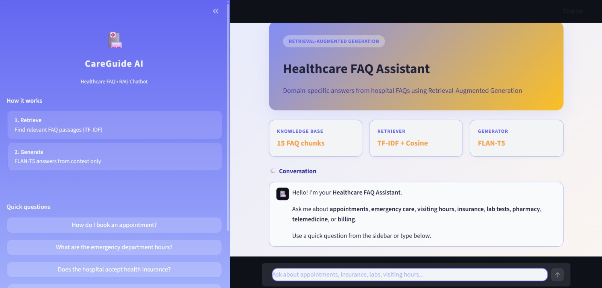
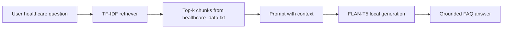

<div align="center">
  <h1>🏥 Healthcare RAG Chatbot</h1>
  <h3>Retrieval-Augmented Generation for Healthcare FAQs</h3>
  
  
  
  
</div>


> ⚠️ <b>Disclaimer:</b> This project is for educational demonstration only. It does not provide medical diagnosis, treatment advice, or emergency services. Always consult qualified healthcare professionals for medical decisions.

---

## 🚀 Project Overview

| <b>Component</b> | <b>Technology</b> | <b>Role</b> |
|:---|:---|:---|
| Knowledge base | <code>healthcare_data.txt</code> | Hospital/healthcare FAQ content (appointments, ED, insurance, labs, etc.) |
| Retriever | TF-IDF + cosine similarity (scikit-learn) | Finds top relevant chunks for each user question |
| Generator | <code>google/flan-t5-base</code> (Transformers) | Produces answers using <b>only</b> retrieved context |
| Frontend | Streamlit (<code>app.py</code>) | Interactive chat UI for demos and submission |

### 🧩 How RAG Works



- <b>Retrieve</b> — Rank FAQ paragraphs by similarity to the question.
- <b>Generate</b> — FLAN-T5 writes a short answer constrained to that context.
- If the fact is missing from the knowledge base, the model is instructed to reply with <i>"Information not available"</i>.

---

## 📁 Project Structure

```
healthcare-rag/
├── app.py                 # Streamlit chat application (main entry)
├── healthcare_chatbot.py  # RAG pipeline: Retriever + LocalGenerator
├── healthcare_data.txt    # Healthcare FAQ knowledge base
├── streamlit_ui.py        # Shared Streamlit UI components
├── download_model.py      # Optional: pre-download FLAN-T5
├── requirements.txt
├── README.md
└── outputs/               # Screenshots for report / viva
    ├── output-1.jpeg
    ├── output-2.jpeg
    ├── output-3.jpeg
    └── output-4.jpeg
```

<b>Output screenshots:</b> See the <code>outputs/</code> folder for demonstration images.

---

## 🛠️ Requirements

- <b>Python 3.10+</b>
- <b>Internet</b> on first run (downloads FLAN-T5 once, ~1 GB)
- <b>RAM:</b> ~4 GB recommended
- <b>Disk:</b> ~2 GB free for model cache
---

## Installation

```powershell
cd "C:\Users\M krishna Prasad\Desktop\genai"
python -m venv .venv
.\.venv\Scripts\activate
pip install -r requirements.txt
```

Use **Transformers 4.x** (`transformers>=4.40.0,<5.0.0` in `requirements.txt`).

---

## How to run

```powershell
streamlit run app.py
```

Open `http://localhost:8501` in your browser.

**First run:** FLAN-T5 downloads from Hugging Face (~1 GB). This can take several minutes.

**Later runs:** Faster startup; works offline after the model is cached.

### Optional: download model first

```powershell
python download_model.py
```

---

## Sample questions

- How do I book an appointment?
- What are the emergency department hours?
- Does the hospital accept health insurance?
- How can I get my lab test results?
- What are the visiting hours for patients?

Use the sidebar sample buttons in the app, or type your own FAQ-style questions.

---

## Customizing the knowledge base

1. Edit `healthcare_data.txt`.
2. One topic per paragraph block.
3. Separate blocks with a **blank line**.
4. Restart Streamlit after changes.

Example topics: appointments, emergency, visiting hours, insurance, laboratory, pharmacy, telemedicine, billing, vaccinations.

---

## Troubleshooting

| Issue | Fix |
|-------|-----|
| `Unknown task text2text-generation` | `pip install "transformers>=4.40.0,<5.0.0"` |
| Slow first response | Model downloading/loading — wait for spinner |
| `healthcare_data.txt` not found | Keep file in project root next to `app.py` |
| Out of memory | Close other apps; free ~4 GB RAM |
| Vague or wrong answers | Improve FAQ text in `healthcare_data.txt`; rephrase question |

---

## Tech stack

- **Python**
- **scikit-learn** — TF-IDF retrieval
- **Transformers + PyTorch** — FLAN-T5 (`google/flan-t5-base`)
- **Streamlit** — web UI


---

## License / credits

- Model: [google/flan-t5-base](https://huggingface.co/google/flan-t5-base) (Apache 2.0)
- GenAI academic project — healthcare domain RAG demonstration
